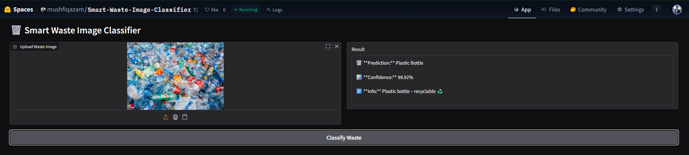

# 🗑️ Smart Waste Image Classifier

An AI-powered web application that classifies waste images into categories such as plastic, glass, battery, food waste, and more, providing recycling and disposal guidance.

---

## 🔗 Live Links

- 🌐 **Project Website (GitHub Pages)**  
  https://mushfiq-azam.github.io/smart-waste-image-classifier/

- 🚀 **Live AI App (Hugging Face Spaces)**  
  https://huggingface.co/spaces/mushfiqazam/Smart-Waste-Image-Classifier

---

## 📌 Project Overview

Proper waste segregation is critical for environmental sustainability.  
This project uses a **deep learning model (ResNet50)** trained with **FastAI & PyTorch** to classify waste images and suggest appropriate recycling or disposal methods.

Users can simply upload an image and instantly get:
- Waste category
- Confidence score
- Recycling / disposal guidance

---

## 🧠 Technologies Used

- **Python**
- **FastAI**
- **PyTorch**
- **ResNet50**
- **Gradio**
- **Hugging Face Spaces**
- **HTML & CSS**
- **GitHub Pages**

---

## 🖼️ Demo Screenshot

---

## ⚙️ How It Works

1. User uploads a waste image
2. Image is processed by a trained ResNet50 model
3. Model predicts the waste category
4. App displays:
   - Prediction
   - Confidence score
   - Recycling / disposal information

---

## 📂 Project Structure

smart-waste-image-classifier/
│
├── assets/
│ └── demo.png
├── index.html
├── style.css
├── README.md
└── LICENSE

---

## 🎯 Features

- Real-time image classification
- High-confidence predictions
- User-friendly web interface
- Environment-focused guidance
- Fully deployed & publicly accessible

---

## 👨‍💻 Author

**Mushfiq Azam**  
Capstone Project — 2026

---

## 📜 License

This project is licensed under the **MIT License**.

