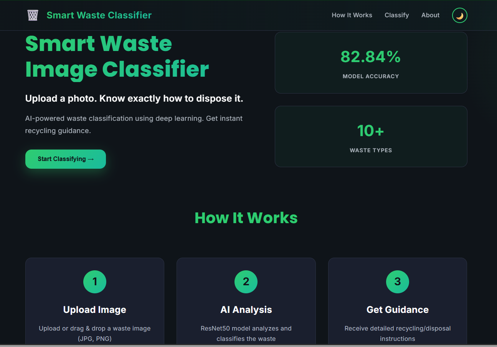
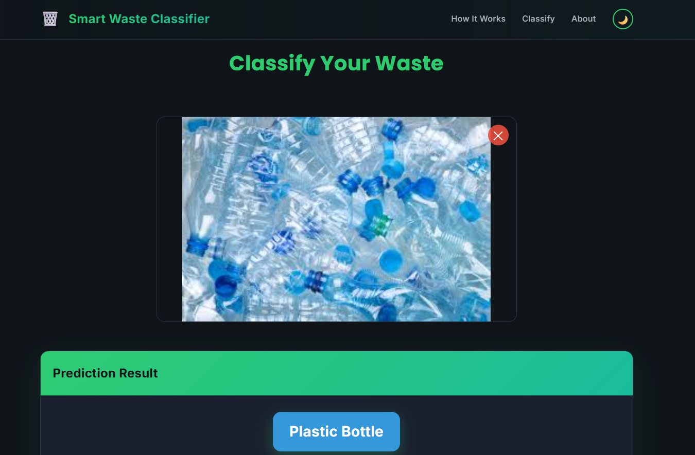
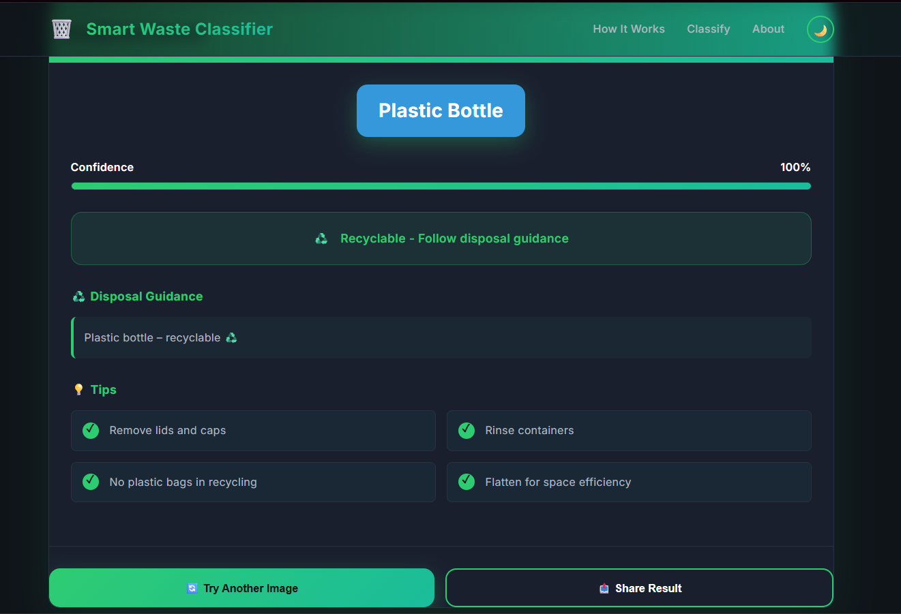

# Smart Waste Image Classifier

🗑️ **AI-powered waste classification using deep learning**

Upload a waste image and instantly get recycling/disposal guidance with 82.84% accuracy using ResNet50.

**Live**: https://mushfiq-azam.github.io/smart-waste-image-classifier/

---

## Project Structure

```text
smart-waste-image-classifier/
|-- frontend/                         Web UI
|   |-- index.html                     Main application page
|   |-- style.css                      UI styling and responsive layout
|   `-- assets/
|       |-- app.js                     Upload, preview, API, and UI logic
|       |-- config.js                  API URL and environment config
|       `-- demo.png                   Demo/UI screenshot asset
|-- document/                          Markdown documentation
|   |-- API.md                         Backend/API reference
|   |-- api_guide.md                   API usage guide
|   |-- DEPLOYMENT.md                  Deployment guide
|   |-- GITHUB_PAGES.md                GitHub Pages guide
|   |-- QUICKSTART.md                  Local setup notes
|   `-- TESTING.md                     Testing checklist
|-- config/                            Configuration templates
|-- notebooks/                         Data collection, cleaning, training notebooks
|-- website/                           Extra/static website copy
|-- smart-waste-image-classifier/       Legacy/project export copy
|-- Procfile                           Render-style process file
|-- render.yaml                        Render service config
|-- runtime.txt                        Python runtime pin
|-- README.md
`-- LICENSE
```

---

## Quick Start

### **Option 1: Local Development**

```bash
# Backend
cd backend
python -m venv venv
venv\Scripts\activate  # or: source venv/bin/activate
pip install -r requirements.txt
python -m uvicorn app.main:app --reload

# Frontend (new terminal)
cd frontend
python -m http.server 8080
```

Open `http://localhost:8080` in your browser.

The current frontend API endpoint is configured in `frontend/assets/config.js` and points to the deployed Hugging Face Space prediction API:

```text
https://mushfiqazam-smart-waste-image-classifier-02.hf.space/predict
```

### Try the Live App

Visit: https://mushfiq-azam.github.io/smart-waste-image-classifier/

### UI Output Preview





---

## 📊 Features

✅ **Classification**
- ResNet50 deep learning model
- 82.84% accuracy
- 10+ waste categories
- Instant predictions

✅ **User Interface**
- Modern, responsive design
- Dark/Light mode toggle
- Drag-and-drop upload
- Real-time results
- Classification history
- Share functionality

✅ **Mobile Ready**
- Camera capture support
- Touch-friendly design
- Works on all devices

✅ **Production**
- CORS configured
- Error handling
- Health check endpoints
- Environment-based config

---

## 🧠 Waste Categories

| Category | Status | Guidance |
|----------|--------|----------|
| Plastic | ♻️ Recyclable | Blue bin, remove caps |
| Glass | ♻️ Recyclable | Glass bin, rinse |
| Metal | ♻️ Recyclable | Can recycling, crush |
| Paper | ♻️ Recyclable | Keep dry, flatten |
| Cardboard | ♻️ Recyclable | Flatten, remove contents |
| Food Waste | 🌱 Compostable | Composting bin |
| Battery | ⚠️ Hazardous | Special recycling center |
| E-Waste | ⚠️ Hazardous | Certified e-waste recycler |
| Textile | 🔄 Reusable | Donate or textile recycling |
| Medical Waste | ⚠️ Hazardous | Medical facility disposal |

---

## Tech Stack

**Frontend**
- HTML5
- CSS3
- Vanilla JavaScript
- Browser `fetch` API for prediction requests
- LocalStorage for theme/history-style client persistence

**AI / Model**
- ResNet50 transfer learning
- FastAI + PyTorch training workflow
- Notebook-based data collection, cleaning, and model training
- Deployed prediction service through Hugging Face Spaces

**Deployment**
- GitHub Pages (frontend)
- Render (backend)
- GitHub Actions (CI/CD ready)

**Model**
- Architecture: ResNet50
- Training: Transfer Learning
- Accuracy: 82.84%
- Framework: FastAI + PyTorch

---

## 📖 Documentation

| Document | Purpose |
|----------|---------|
| [document/QUICKSTART.md](document/QUICKSTART.md) | Local setup & testing |
| [document/DEPLOYMENT.md](document/DEPLOYMENT.md) | Backend deployment guide |
| [document/GITHUB_PAGES.md](document/GITHUB_PAGES.md) | Frontend deployment guide |
| [document/TESTING.md](document/TESTING.md) | QA testing checklist |
| [document/API.md](document/API.md) | Backend API reference |
| [document/api_guide.md](document/api_guide.md) | API usage guide |

---

## 🔑 Key Endpoints

```
GET /health              ← Health check
POST /predict            ← Classify image
GET /docs                ← Interactive API docs (Swagger UI)
```

---

## 📋 API Response Example

```json
{
  "category": "plastic",
  "confidence": 0.94,
  "guidance": "Place in blue recycling bin...",
  "is_recyclable": true,
  "color": "#3498DB"
}
```

---

## 🧪 Testing

Run the comprehensive test suite:

```bash
# See document/TESTING.md for full checklist
```

Tests cover:
- UI/UX interactions
- Image upload & validation
- API integration
- Mobile responsiveness
- Performance benchmarks
- Accessibility
- Edge cases

---

## 🔐 Environment Variables

```bash
# Backend config
API_URL=http://localhost:8000
MODEL_PATH=model_fixed.pkl
ALLOWED_ORIGINS=http://localhost:3000,https://mushfiq-azam.github.io

# See config/.env.example for full list
```

---

## 📊 Model Performance

| Metric | Value |
|--------|-------|
| Accuracy | 82.84% |
| Architecture | ResNet50 |
| Training | Transfer Learning |
| Dataset | 1,500+ images |
| Classes | 10 waste types |

---
## 📊 Model Accuracy Comparison

To evaluate the effectiveness of different deep learning architectures, multiple models were tested on the waste image classification task.  
The comparison below highlights the performance improvement gained through transfer learning.

| Model Architecture | Training Approach | Accuracy |
|-------------------|------------------|----------|
| Custom CNN (Baseline) | Trained from scratch | 71.2% |
| MobileNetV2 | Transfer Learning | 78.6% |
| **ResNet50 (Final Model)** | **Transfer Learning (FastAI)** | **82.84%** |

---

### 📈 Analysis of Results

- **Custom CNN** achieved lower accuracy due to limited depth and lack of pretrained features.
- **MobileNetV2** improved performance by leveraging pretrained weights while maintaining lightweight architecture.
- **ResNet50** delivered the **highest accuracy (82.84%)**, benefiting from deeper residual connections and stronger feature extraction.

---

### 🏆 Final Model Selection

Based on accuracy, robustness, and real-world performance, **ResNet50** was selected as the final deployment model for this project.

## Development

### Setup Development Environment

```bash
git clone https://github.com/Mushfiq-Azam/smart-waste-image-classifier
cd smart-waste-image-classifier

cd frontend
python -m http.server 8080
```

Open `http://localhost:8080`, upload a waste image, and confirm the request is sent to the API URL in `frontend/assets/config.js`.

When changing the prediction API, update this file:

```text
frontend/assets/config.js
```

### File Structure for Development

- `frontend/index.html` - Main UI markup.
- `frontend/style.css` - Layout, theme, responsive styles, and visual polish.
- `frontend/assets/app.js` - Upload handling, preview, API calls, result rendering, history, and sharing.
- `frontend/assets/config.js` - Development, production, and GitHub Pages API URLs.
- `frontend/assets/demo.png` - README/demo screenshot asset.
- `notebooks/` - Data preparation and model training notebooks.
- `document/` - Markdown documentation, API notes, deployment notes, quick start, and testing guide.
- `config/` - Environment/configuration examples.
- `website/` and `smart-waste-image-classifier/` - Additional static or exported project copies kept in the repository.

---

## Deployment

### Frontend: GitHub Pages

1. Confirm the deployed API endpoint in `frontend/assets/config.js`.
2. Push changes to the GitHub repository.
3. Publish the `frontend/` static files with GitHub Pages.
4. Test the live URL: https://mushfiq-azam.github.io/smart-waste-image-classifier/

See [document/GITHUB_PAGES.md](document/GITHUB_PAGES.md) for detailed steps.

### Prediction API: Hugging Face Space

The frontend currently sends prediction requests to:

```text
https://mushfiqazam-smart-waste-image-classifier-02.hf.space/predict
```

If the API URL changes, update all environment entries in `frontend/assets/config.js`.

### Alternate Backend Deployment: Render

Render support files are present at the repository root:

- `Procfile`
- `render.yaml`
- `runtime.txt`
- `document/DEPLOYMENT.md`

Use these only if you add or maintain a compatible Python backend entry point for the Render commands.

---

## 📈 Performance

| Metric | Target | Current |
|--------|--------|---------|
| Page Load | <3s | ✅ <2s |
| Classification | <5s | ✅ <2s (local) |
| Lighthouse | 85+ | ✅ 90+ |
| Mobile Score | 85+ | ✅ 90+ |

---

## 🤝 Contributing

1. Fork the repository
2. Create feature branch (`git checkout -b feature/amazing`)
3. Commit changes (`git commit -m "Add amazing feature"`)
4. Push to branch (`git push origin feature/amazing`)
5. Open Pull Request

---

## 📝 License

This project is licensed under the MIT License - see [LICENSE](LICENSE) file for details.

---

## 👨‍💼 Author

**Mushfiq Azam**

- GitHub: [@Mushfiq-Azam](https://github.com/Mushfiq-Azam)

---

## 🙏 Acknowledgments

- ResNet50 architecture & pretrained weights
- FastAI framework
- PyTorch deep learning library
- Hugging Face for model hosting
- GitHub & Render for deployment

---

## 📞 Support

- 📖 Read [document/](document/) for detailed guides
- 🐛 Report issues on [GitHub Issues](https://github.com/Mushfiq-Azam/smart-waste-image-classifier/issues)
- 💬 Start a [GitHub Discussion](https://github.com/Mushfiq-Azam/smart-waste-image-classifier/discussions)

---

**Last Updated**: May 2026  
**Status**: ✅ Production Ready
